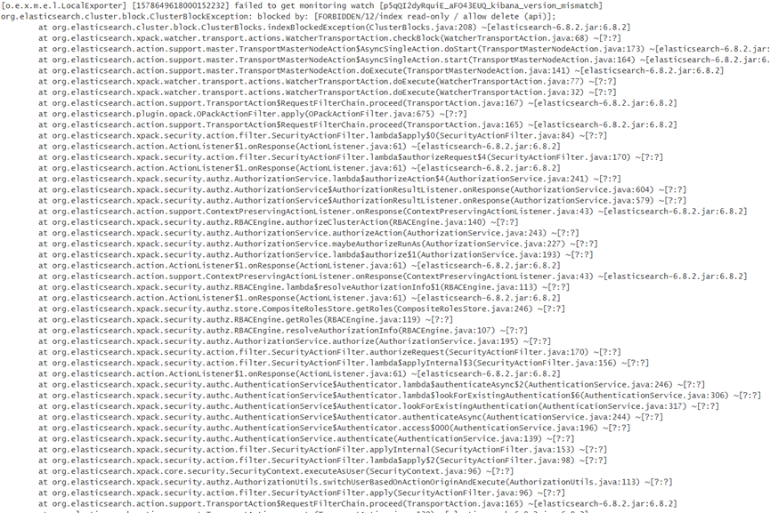

<h4>FAQ1:org.elasticsearch.cluster.block.ClusterBlockException: blocked by: [FORBIDDEN/12/index read-only / allow delete (api)];</h4>

原因：

结合异常信息报错与集群资源使用情况，可以发现磁盘使用率已经超过警戒阈值，较大的磁盘占用率导致了查询数据超时的情况。
解决办法：
1.	参数调整  "index.blocks.read_only_allow_delete": null  
      PUT _settings
      {
      "index.blocks.read_only_allow_delete": false
      }
2.	对ES的磁盘与集群进行扩容。或者删除索引数据释放磁盘空间。

