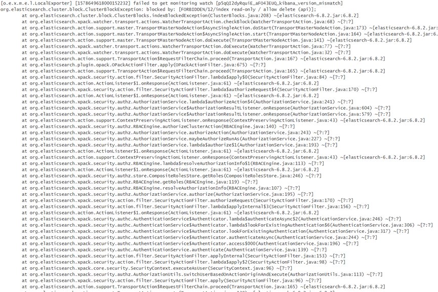
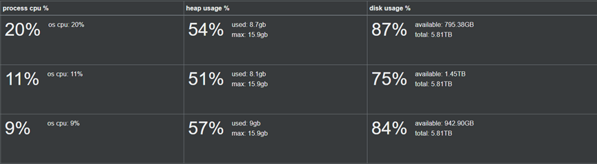
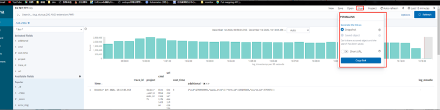
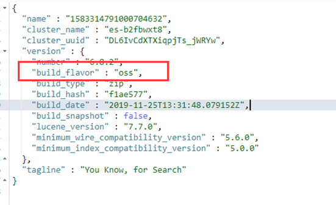

FAQ1:org.elasticsearch.cluster.block.ClusterBlockException: blocked by: [FORBIDDEN/12/index read-only / allow delete (api)];

原因：

结合异常信息报错与集群资源使用情况，可以发现磁盘使用率已经超过警戒阈值，较大的磁盘占用率导致了查询数据超时的情况。
解决办法：
1.	参数调整  "index.blocks.read_only_allow_delete": null  
      PUT _settings
      {
      "index.blocks.read_only_allow_delete": false
      }
2.	对ES的磁盘与集群进行扩容。或者删除索引数据释放磁盘空间。

FAQ2：节点监控CPU利用率为何各个节点之间不均匀，这个问题如何处理呢？

原因：ES集群中有四台热节点，当我们进行数据写入的时候，会先将读写请求，先会对主分片进行写入，然后转发请求，将分片的数据，复制到其他分片。对副本分片进行写入。所以会出现某一个热节点CPU使用率较高的情况。根据集群状态信息，这种情况有可能读写都操作在同一台节点上。
同时需要索引索引的主副分片数是否合理。
解决办法：由于是CPU使用率较高，集群环境是2C8G，CPU配置较低。建议提高CPU核数。在后续索引重新规划主分片数，尽量使主分片数与数据节点数保持倍数关系。

FAQ3："code":5002,"message":"elastic: Error 429 (Too Many Requests): rejected execution of org.elasticsearch.transport.TransportService$7@2eaee51a on EsThreadPoolExecutor 
原因：由于ES线程池在某一个时间段群收到大量请求且无法再接收任何请求时通常会发生“es_rejected_execution_exception”异常。每个节点都有一个线程池队列，可以容纳 50 到 200 个请求，具体取决于您使用的 Elasticsearch 版本。队列已满时，将拒绝新请求。 
解决办法：
1.添加更多节点：每个节点都有一个批量队列，因此添加更多节点可以为您提供更多的排队容量。
2.切换到更大的实例类型：对于批量请求，每个节点上线程池中的线程数等于可用处理器的数量。切换到具有更多虚拟 CPU (vCPU) 的实例，以获取更多线程来处理批量请求。
3.优化批量请求大小：不是发送许多小批量请求，而是发送一些大批量请求。  您这边可以根据您的实际业务场景进行对应的优化。
4.改善索引性能：当文档编制索引速度更快时，批量队列不太可能达到容量。有关性能优化的更多信息，请参阅 Elasticsearch 文档中的索引性能提示。
   ES线程池链接：https://www.elastic.co/guide/en/elasticsearch/guide/current/_monitoring_individual_nodes.html#_threadpool_section
   ES索引性能优化链接：
   https://www.elastic.co/guide/en/elasticsearch/guide/current/indexing-performance.html

FAQ4：客户使用的kibana无法导出CSV数据。ES 版本6.8.2

原因：客户使用的是开源版ES。功能不完整。
使用GET /命令可以在kibana中查看ES版本。

FAQ5：断路器专题

FAQ6：字段类型从keyword修改为text执行reindex报错"reason": "Mixing up field types: class org.elasticsearch.index.mapper.KeywordFieldMapper$KeywordFieldType != class org.elasticsearch.index.mapper.TextFieldMapper$TextFieldType on field manual_tags"

FAQ7：由于长期未处理分片导致分片不均，进而集群健康状态yellow 
原因：由于集群中个别的index分片不均，导致单个分片容量过大。es在分配分片时超出最大重试次数后，就不会在尝试恢复。需要手动触发。
解决办法：POST _cluster/reroute?retry_failed=true  执行命令，手动让es重新均衡分片。

FAQ8：logstash向ES写入数据，报错：ElasticSearch logstash getting 403 response when trying to call /_bulk (on private IP)
原因：由于ES集群磁盘空间已满，导致ES拒绝logstash的数据写入请求。具体需要结合上下游情况进行分析。 
解决办法：对ES集群磁盘进行扩容或者删除部分索引数据释放磁盘空间
